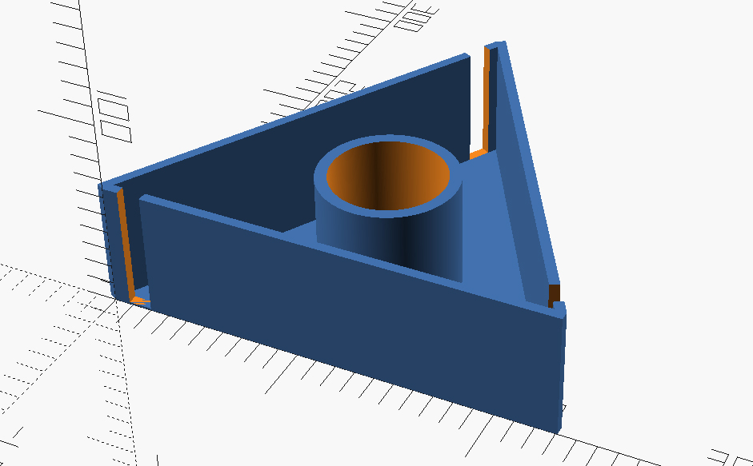
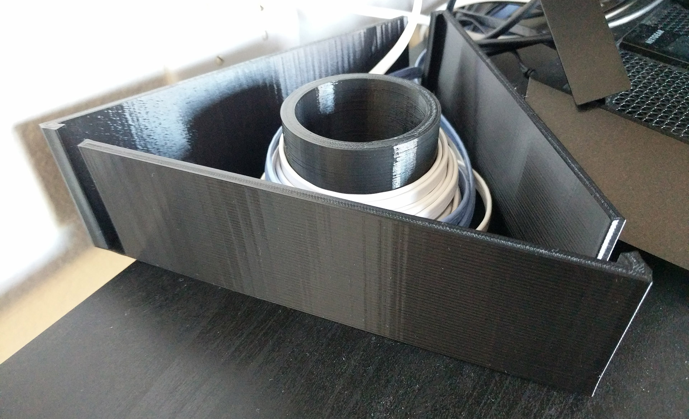
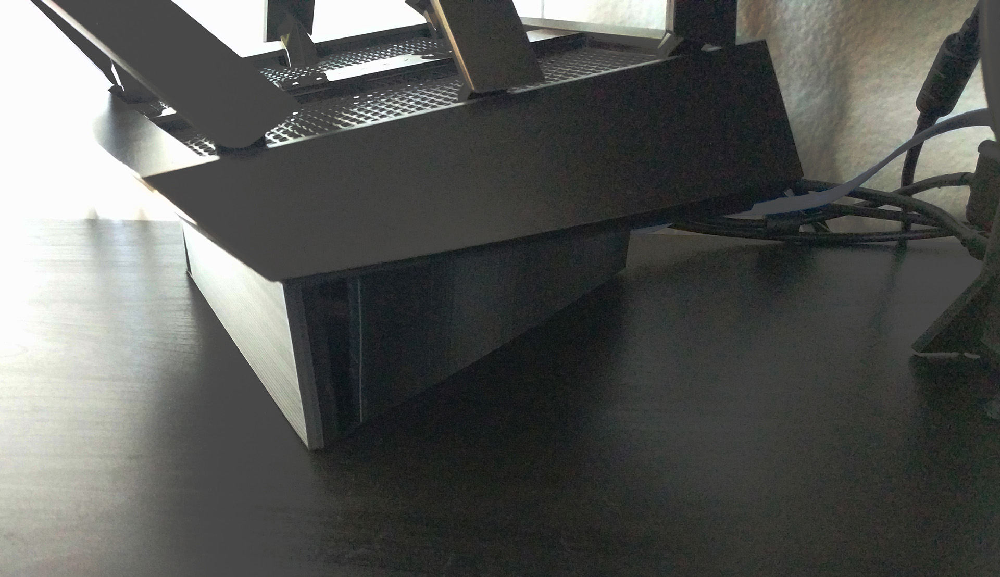

# Cable Storage Triangle

### Parametric triangle with an inner cylinder to wrap cables

My home router sits on my desktop, which lead to an excess of cables from networked devices along with the usual cable clutter from monitors, USB accessories, etc.  
This little piece sits neatly under my router to store excess cables.  
Basic triangle shape with slits at the corners and a cylinder in the middle for wrapping cables. Nothing fancy.  
  
The design uses a single "side" frame, rotated and translated at angles to form a hollow triangle, all sitting on a 1mm thick base.  
At the triangle's calculated incenter there is a cylinder sticking up the same height as the sides that also cuts a hole through the base (to speed up printing).  
  
Length, width, height, and various thickness parameters are expressed in the code.  
  
Screenshot from OpenSCAD:  

Photos of the printed result:

  
Feel free to share and adapt for personal use only.
